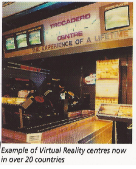
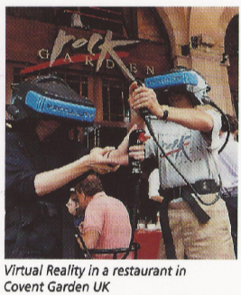
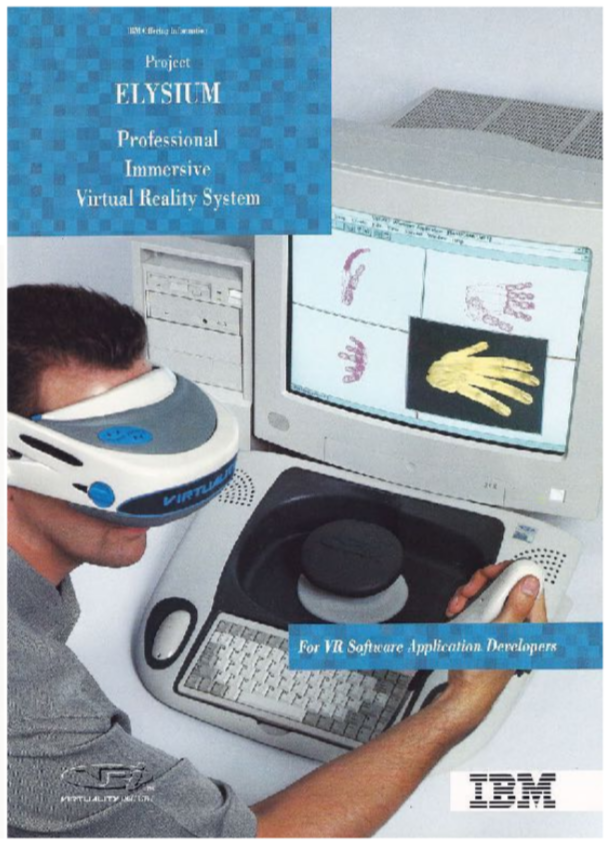

---

### VR in the browser
#### Rigel Di Scala

---

### Origins of VR

---

### 1968: First head mounted display
#### engineered by Ivan Sutherland

---

### 1983: "Virtual Reality"
#### term introduced Jason Lanier
 - founded VPL Research
 - pioneered first consumer grade devices
 - went bankrupt
 - patents sold to Sun Microsystems
    - now owned by Oracle?

---

### 1985 → 199X: Virtuality & Elysium
Extremely expensive machines (£20,000 → £40,000)

+++

+++

+++

---

# Questions?
