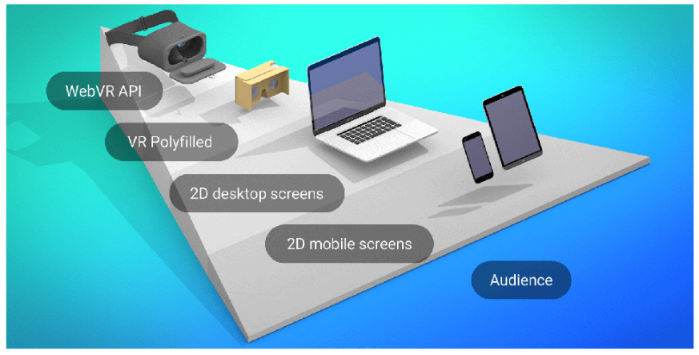
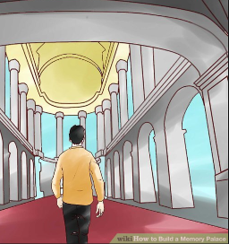

---

# VR in the browser
## Rigel Di Scala
### Arch at Wipro Digital

---

## The origins of VR

---

### 1968: First head mounted display
#### engineered by Ivan Sutherland

---

### 1983: "Virtual Reality"
#### term introduced Jason Lanier


---

### 1985 → 199X: Virtuality & Elysium
Extremely expensive machines (£20,000 → £40,000)

---?image=assets/virt1.png&size=contain

---?image=assets/virt2.png&size=contain

---?image=assets/virt3.png&size=contain

---

### 1992: "Lawnmower man"


---

### 1992: Neil Stephenson's Snow Crash

Describes the "Metaverse", a collective virtual world accessed using terminals and headsets, experienced in first-person 3D.


---

### Problems with 90s VR tech

 - Expensive |
 - High latency → Motion sickness |
 - Unattractive graphics |

---


---

### 1995-2009: VR Dark Ages

Graphics make rapid progress, unlike VR.


---

2009: Oculus Rift

Palmer Luckey crowdfunds the first new gen headset.


---

### Outstanding problems

 - Motion sickness still an issue |
 - Bulky headsets |
 - Screens not high def enough |
 - High end PC required |
 - Flaky FPS support |
 - No killer app yet (maybe Elite Dangerous)|


---

### But... VR is now portable!


---

### WebVR

Open spec for VR in the browser.

Polyfill available! Useful for Cardboard devices.


---

Is VR the tallest step in the progressive enhancement ladder?



Source: unboring.net

---

### Example 1: Boost immersiveness


---

### Example 2: VR for sense of scale


---

### Example 3: More effective learning

Based on the "Memory Palace" technique.




---

### Things to consider

 - Content cannot be consumed anywhere
 - Scenarios need to tailored to the capabilities
 - **Performance must be consistent**
 - Always target 90FPS

---

### Design tips

 - Photorealistic graphics not important
 - Support both VR and non-VR devices
 - Focus on the experience (audio, sense of scale)

---

### What to use?

---

### A-FRAME: VR web framework

 - Build scenes using declarative markup
 - Cross-platform
 - Entity-component architecture
 - Optimised for performance
 - Library of reusable components
 - Developer tools, e.g. inspector
 - Made by Mozilla!

---

### A-FRAME example

```<body>
    <a-scene>
      <a-box position="-1 0.5 -3" rotation="0 45 0" color="#4CC3D9"></a-box>
      <a-sphere position="0 1.25 -5" radius="1.25" color="#EF2D5E"></a-sphere>
      <a-cylinder position="1 0.75 -3" radius="0.5" height="1.5" color="#FFC65D"></a-cylinder>
      <a-plane position="0 0 -4" rotation="-90 0 0" width="4" height="4" color="#7BC8A4"></a-plane>
      <a-sky color="#ECECEC"></a-sky>
    </a-scene>
  </body>
```


---


---

### Unity

 - Uses a cut-down version of the engine for WebGL
 - Export to HTML5 + JavaScript
 - Use the Unity IDE to create your game


---

### Other frameworks

 - ReactVR
 - BabylonJS

---

### How do I ship my VR app?

 - Send a link! |
 - (Electron|Cordova) + WebVR + $APP_STORE |

 1. Get 'em addicted to a free taster on the Web |
 2. Sell 'em the full version on Steam/GOG/Play/etc. |
 3. ??? |
 4. PROFIT!!! |

---

### Three.js

Low level approach

 - Three.js + WebVR libraries & polyfills
 - Check out my boilerplate on Github: https://github.com/zedr/cordova_vr
 - Tip: BufferGeometries whenever you can


---

```html
<!-- Base configuration for the VR app -->
<script src="libs/VRconfig.js"></script>
<!-- A polyfill for Promises. Needed for IE and Edge. -->
<script src="libs/vendor/es6-promise/es6-promise.min.js"></script>
<!-- three.js 3d library -->
<script src="libs/vendor/three/three.min.js"></script>
```

---

index.html

```html
<!-- VRControls.js acquires positional information from connected VR devices 
     and applies the transformations to a three.js camera object. -->
<script src="libs/vendor/vr/VRControls.js"></script>
<!-- VREffect.js handles stereo camera setup and rendering. -->
<script src="libs/vendor/vr/VREffect.js"></script>
<!-- A polyfill for WebVR using the Device{Motion,Orientation}Event API. -->
<script src="libs/vendor/vr/webvr-polyfill.min.js"></script>
<!-- A set of UI controls for entering VR mode. -->
<script src="libs/vendor/vr/webvr-ui.min.js"></script>
<!-- Finally, our game... -->
<script src="libs/app/game.js"></script>
```

---

game.js

```javascript
camera = new THREE.PerspectiveCamera(75, aspect, 0.1, 10000);
// Apply VR stereo rendering to renderer.
effect = new THREE.VREffect(renderer);
effect.setSize(window.innerWidth / window.innerHeight);
```
```javascript
navigator.getVRDisplays().then(function (displays) {
  vrDisplay = displays[0];
  vrDisplay.requestAnimationFrame(render);
});
```
```javascript
effect.render(scene, camera);
vrDisplay.requestAnimationFrame(render);
```
---

[DEMO](https://github.com/zedr/cordova_vr)
