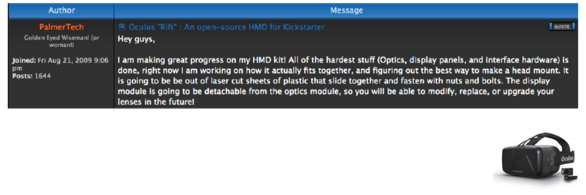

---

### VR in the browser
#### Rigel Di Scala

---

### Origins of VR

---

### 1968: First head mounted display
#### engineered by Ivan Sutherland

---

### 1983: "Virtual Reality"
#### term introduced Jason Lanier
 - founded VPL Research |
 - pioneered first consumer grade devices |
 - went bankrupt |
 - patents sold to Sun Microsystems |
    - now owned by Oracle? |

---

### 1985 → 199X: Virtuality & Elysium
Extremely expensive machines (£20,000 → £40,000)

---?image=assets/virt1.png&size=contain

---?image=assets/virt2.png&size=contain

---?image=assets/virt3.png&size=contain

---

### 1992: "Lawnmower man"

---

### Problems with 90s VR tech

 - Expensive |
 - High latency → Motion sickness |
 - Unattractive graphics |

---

---

### 1995-2012: VR Dark Ages

Graphics tech makes rapid progress...

while VR tech goes into a lull.

---

2009: Oculus Rift

Palmer Luckey crowdfunds the first new gen headset.

---

The pros get involved...

---

... and the big corporations

---?image=assets/brains.png&size=contain

---

### New tech solves many problems ...

 - Low latency |
 - Better FOV |
 - Sharper image |
 - Realistic graphics |

---

### but not all of them:

 - Motion sickness still an issue |
 - Bulky headsets |
 - Screens not high def enough |
 - High end PC required |
 - Flaky FPS support |
 - No killer app yet |

### VR is portable!

---

### WebVR

---

Is VR the tallest step in the progressive enhancement ladder?

Source: unboring.net

---

### Example: Sortie en mer

---

### Example: Sherry FitzGerald

---

### Things to consider for VR

 - Content cannot be consumed anywhere
 - Scenarios need to tailored to the capabilities
 - **Performance must be consistent** 

---

### What to use?

---

### A-FRAME: VR web framework

 - Build scenes using declarative markup
 - Cross-platform
 - Entity-component architecture
 - Optimised for performance
 - Library of reusable components
 - Developer tools, e.g. inspector

---

---

# Questions?
