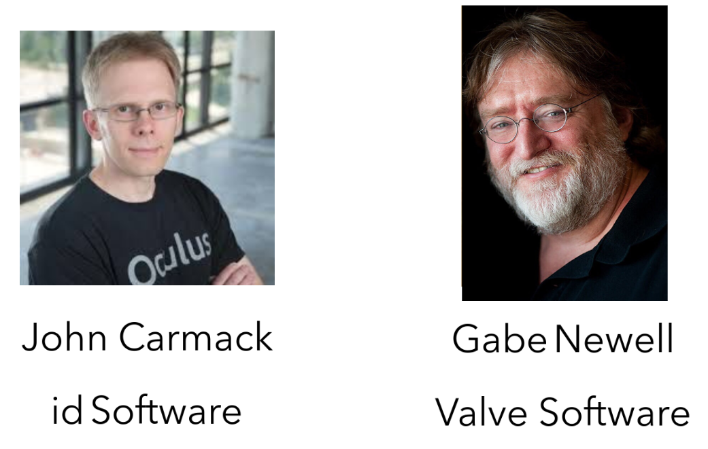

---

# VR in the browser
## Rigel Di Scala
### Arch at Wipro Digital

---

## Origins of VR

---

### 1968: First head mounted display
#### engineered by Ivan Sutherland

---

### 1983: "Virtual Reality"
#### term introduced Jason Lanier
 - founded VPL Research |
 - pioneered first consumer grade devices |
 - went bankrupt |
 - patents sold to Sun Microsystems |
    - now owned by Oracle? |


---

### 1985 → 199X: Virtuality & Elysium
Extremely expensive machines (£20,000 → £40,000)

---?image=assets/virt1.png&size=contain

---?image=assets/virt2.png&size=contain

---?image=assets/virt3.png&size=contain

---

### 1992: "Lawnmower man"


---

### Problems with 90s VR tech

 - Expensive |
 - High latency → Motion sickness |
 - Unattractive graphics |

---


---

### 1995-2012: VR Dark Ages

Graphics tech makes rapid progress...


while VR tech goes into a lull.

---

2009: Oculus Rift

Palmer Luckey crowdfunds the first new gen headset.


---

The pros get involved...



---

... and the big corporations


---?image=assets/brains.png&size=contain

---

### New tech solves many problems ...

 - Low latency |
 - Better FOV |
 - Sharper image |
 - Realistic graphics |


---

### but not all of them:

 - Motion sickness still an issue |
 - Bulky headsets |
 - Screens not high def enough |
 - High end PC required |
 - Flaky FPS support |
 - No killer app yet |


### VR is portable!


---

### WebVR


---

Is VR the tallest step in the progressive enhancement ladder?


Source: unboring.net

---

### Example: Sortie en mer


---

### Example: Sherry FitzGerald


---

### Things to consider for VR

 - Content cannot be consumed anywhere
 - Scenarios need to tailored to the capabilities
 - **Performance must be consistent** 

---

### What to use?

---

### A-FRAME: VR web framework

 - Build scenes using declarative markup
 - Cross-platform
 - Entity-component architecture
 - Optimised for performance
 - Library of reusable components
 - Developer tools, e.g. inspector

---


---

### Unity

 - Uses a cut-down version of the engine for WebGL
 - HTML5 + JavaScript
 - Use the Unity IDE to create your game


---

### Three.js

Low level approach

 - Three.js + WebVR libraries & polyfills
 - Check out my boilerplate on Github: https://github.com/zedr/cordova_vr


---

```html
<!-- Base configuration for the VR app -->
<script src="libs/VRconfig.js"></script>
<!-- A polyfill for Promises. Needed for IE and Edge. -->
<script src="libs/vendor/es6-promise/es6-promise.min.js"></script>
<!-- three.js 3d library -->
<script src="libs/vendor/three/three.min.js"></script>
```

---

index.html

```html
<!-- VRControls.js acquires positional information from connected VR devices 
     and applies the transformations to a three.js camera object. -->
<script src="libs/vendor/vr/VRControls.js"></script>
<!-- VREffect.js handles stereo camera setup and rendering. -->
<script src="libs/vendor/vr/VREffect.js"></script>
<!-- A polyfill for WebVR using the Device{Motion,Orientation}Event API. -->
<script src="libs/vendor/vr/webvr-polyfill.min.js"></script>
<!-- A set of UI controls for entering VR mode. -->
<script src="libs/vendor/vr/webvr-ui.min.js"></script>
<!-- Finally, our game... -->
<script src="libs/app/game.js"></script>
```

---

game.js

```javascript
camera = new THREE.PerspectiveCamera(75, aspect, 0.1, 10000);
// Apply VR stereo rendering to renderer.
effect = new THREE.VREffect(renderer);
effect.setSize(window.innerWidth / window.innerHeight);
```
```javascript
vrDisplay = displays[0];
vrDisplay.requestAnimationFrame(render);
```
```javascript
effect.render(scene, camera);
vrDisplay.requestAnimationFrame(render);
```
---

[DEMO](https://github.com/zedr/cordova_vr)

---
